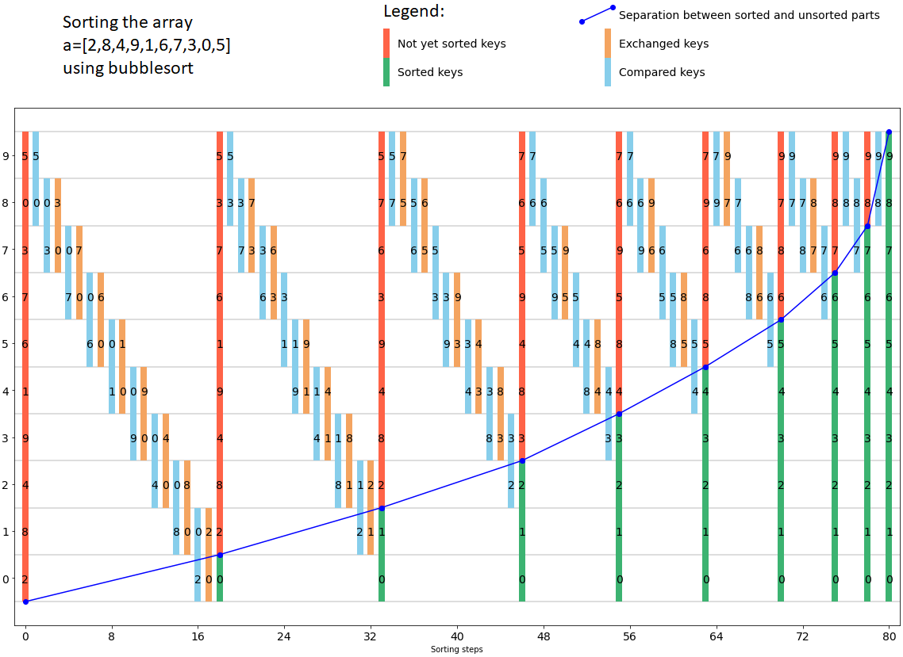
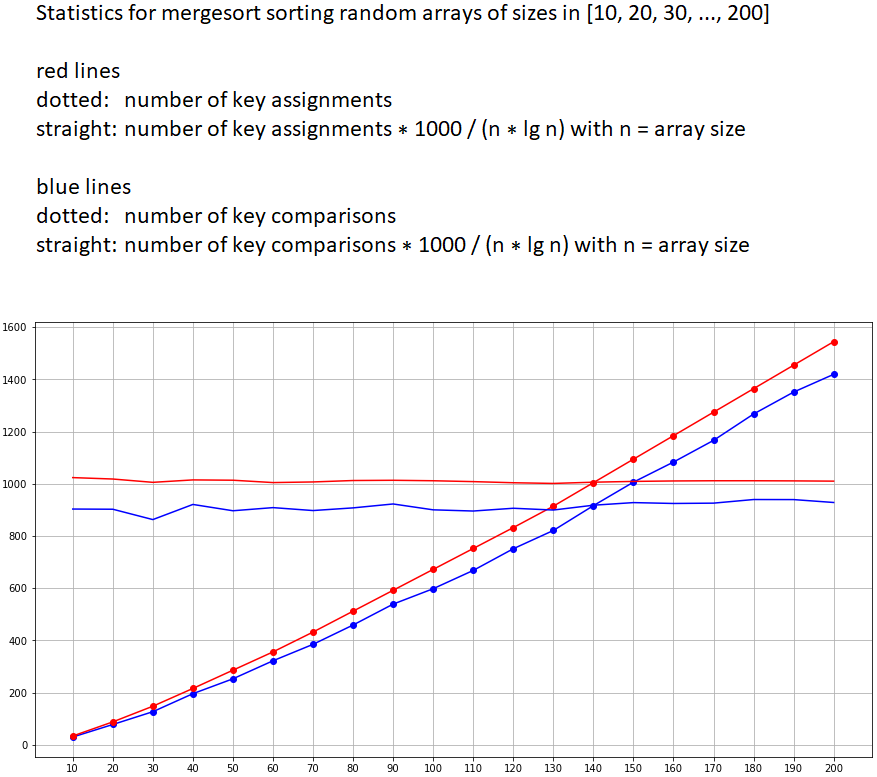
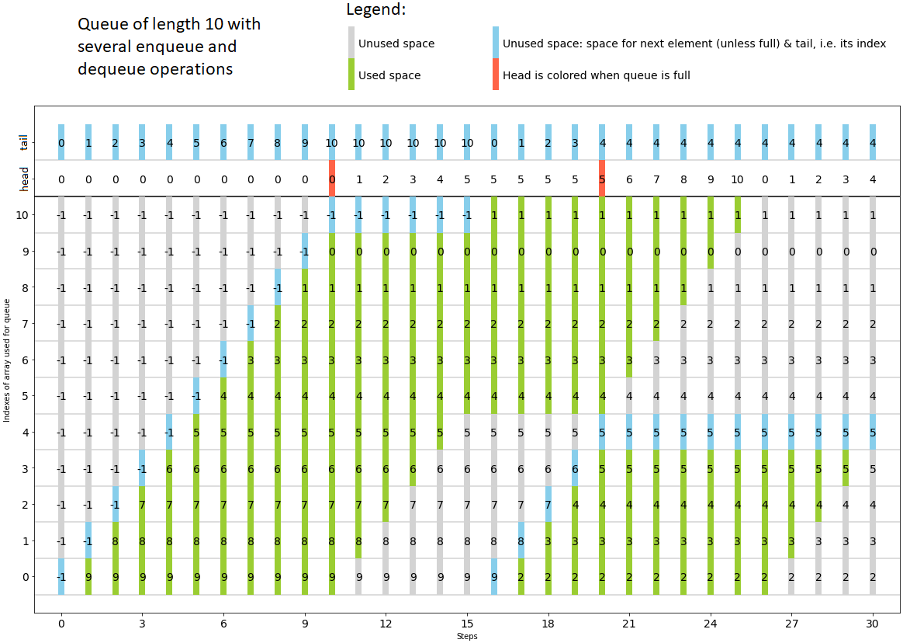

**<-- click here to open the Jupyter notebooks without any installation in a web browser**

## AlgDat
Supplemental material for lecture Algorithms and Data Structures - not only at Frankfurt University of Applied Sciences

This repository provides Jupyter notebooks with the implementation of basic algorithms and data structures.
You can play around with the code in many ways.
The intention is to deepen the undestanding by adapting and running the code.
We use simple [naming conventions](namingConventions.md) here.

For more details please look into [the FAQs](FAQs.md).
For a motivation what kind of information the notebooks provide, see some examples below.

## Important points when working with Jupyter Notebooks
* To open a notebook just double click it in the file explorer on the left hand side.
* Before running parts of a notebook (e.g. after you changed something), you first need to execute the complete code.
* For execution of the complete code in a notebook click on "Kernel", then on "Restart Kernel and Run All Cells ...".
* To close a notebook click on "File", then on "Close and Shutdown Notebook".
* At the end of your experiments click on "File", then on "Shutdown".
* Note that you cannot save your work such that it is available when you launch the binder next time.
* But there are different possibilities, see "File" menu, for example:
  * Work locally on your computer or in a repository you own. You need appropriate software installed on your computer.
  * Save the files to browser cache and restore them later. There are two buttons in Jupyter notebook.
* Find the right way for you to work with this code and consider the respective documentation for it.

## Have fun using it!

Here are some pictures to get an idea of what can be done with the notebooks.
The pictures contain explanatory text and in the queue example the words "head" and "tail" were added for a better understanding.
In the notebooks, this information is visible in the code.

## Thanks
Many thanks to Edward Späth for extending this repository. Several new algorithms (on non-linear data) had been added. Very good job!
